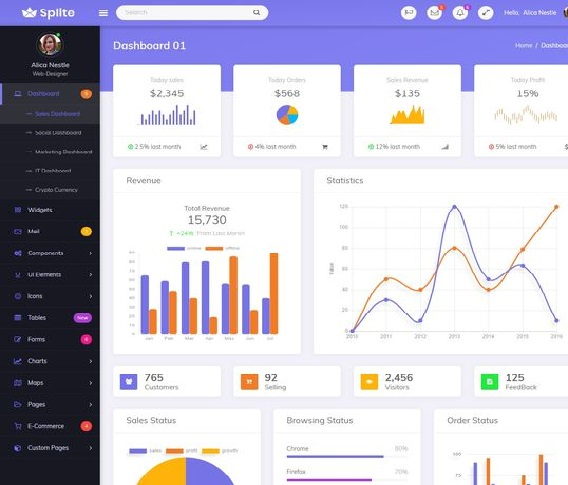
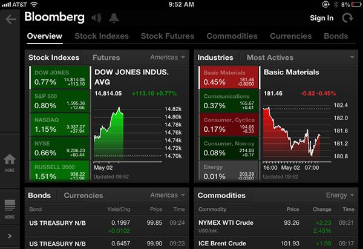
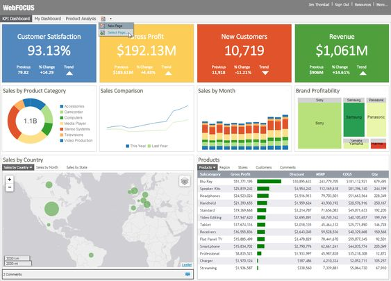

layout: true
background-image: url(imag/Logo_enrdados_blanco.png)
background-position: 98% 1% 
background-size: 6%

```{r setup, include=FALSE}
#<div class="my-footer"><span>www.enRdados.net</span></div> 
options(htmltools.dir.version = FALSE)
library("xaringan")
# https://yihui.name/en/2017/08/why-xaringan-remark-js/
# para verolo en directo
#  xaringan::inf_mr()
#https://yihui.name/en/2019/02/ultimate-inf-mr/
# https://slides.yihui.name/xaringan/#8
# https://yihui.name/en/2017/08/why-xaringan-remark-js/
# para guardar la presentacion como pdf
# necesito el paquete pagedown y chrome instalado en el PC
# pagedown::chrome_print("C:/R/proyectos/mentoring/pMentoring3.html")
#
#     css:
#      - default
#      - default-fonts 
#      - "animate.min.css"  
```


---
class: animated, fadeInRight

# Índice resumen

- ¿qué es `flexdashboard`?

- Diseño de paneles `r icon::fa('arrow-alt-circle-right')` **Práctica**
 
- Iteractividad I  `r icon::fa('arrow-alt-circle-right')` **Práctica**

- Iteractividad II (htmlWidgets) `r icon::fa('arrow-alt-circle-right')` **Práctica** 

- Iteractividad III (*Shiny* ) `r icon::fa('arrow-alt-circle-right')` **Práctica **

- Diseño avanzado y publicación `r icon::fa('arrow-alt-circle-right')` **Práctica**


---

#¿qué es *flexdashboard*?

[flexdashboard](https://rmarkdown.rstudio.com/flexdashboard/) es una extensión de *Rmarkdown* desarrollada por RSTUDIO para facilitar la creación de paneles web (también se llaman tableros o simplemente applicaciones web).

<https://rmarkdown.rstudio.com/flexdashboard/>

Estos tableros pueden ser estáticos o dinámicos según la forma de interacción con el cliente -servidor de datos.


---

# ¿qué es un tablero?

Estos son algunos ejemplos de tableros (estáticos, de visualización de datos)


---
# Ejemplo bolsa



---

# Ejemplos de tableros


---
# Ejemplo real -estático-

<iframe src="flexdashboard-talk-master/wastelands.html" width="800" height="600">
</iframe>

---
# Ejemplo real - shiny -

<iframe src="https://walkerke.shinyapps.io/neighborhood_diversity/" width="800" height="600">
</iframe>

---

class: inverse

# Crear una app 

 1. Diseño de la plantilla 
 2. Programación y relleno de cajas
 3. Subir a un servidor o enviar fichero `html`


---

# Fichero de partida rmarkdown

```YAML
---
title: "Row Orientation" 
output: 
    flexdashboard::flex_dashboard: 
      orientation: rows
---
    
## Row

### Chart 1
   
## Row

### Chart 2
    
### Chart 3

```

---

# Encabezado YAML de flexdashboard

```YAML
---
title: "Mi primer tablero"
output:
  flexdashboard::flex_dashboard:
    orientation: columns
    vertical_layout: fill
    logo: "imag/logoR.png"
    social: menu
    source_code: embed
    theme: united
   # css: bootswatch-3.3.5-4/flatly/bootstrap.css
runtime: shiny
---

```

---
class: animated, fadeInLeft

# Formato 

Cualquier tablero la crearemos a partir de 3 niveles básicos:

.pull-left[

1. **Páginas** 
```
#        `===`
```
2. **Columnas - filas**
```
##       `---` 
```
3. **Cajas** 
```
### 
```
4. Extras:
   + {.sidebar} (niveles 2 y 3)
   + {.tabset} (niveles 2 y 3)
   + {data-width=350} 
   + {data-height=}
]

.pull-right[


]
---


# Complementos

## Value boxes

```{r, eval=FALSE}
library(flexdashboard)
articles <- 204
valueBox(articles, 
         icon = "fa-pencil", 
         caption = "Articles per Day")
```


---

# gauge

```{r, eval=FALSE}

satisfaction <- 86
gauge(satisfaction, min = 0, max = 100, symbol = '%', 
  label = "Satisfaction", gaugeSectors(
  success = c(80, 100), warning = c(40, 79), danger = c(0, 39)
))
```


---

class: inverse, center, middle

# Interactividad simple

```{r echo=FALSE, fig.align='center', out.width = "600px", out.height="400px"}

```

--

El mentoring es la `r icon::fa('key')` para abrir muchas `r icon::fa('door-open')`

---
class: animated, jackInTheBox

# Objetivos del programa

- Acelerar el proceso de desarrollo personal `r icon::fa('rocket')`
- Favorece la transmisión de valores y conocimiento `r icon::fa('people-carry')`
- Transmitir experiencia `r icon::fa('user-graduate')`
- Crea vínculos personales, profesionales y de colectivo.`r icon::fa('handshake')`
- Motiva, mejora la confianza y refuerza la iniciativa personal. `r icon::fa('award')`

```{r echo=FALSE, out.width = "500px", out.height="250px",fig.align='center'}
knitr::include_graphics("imag/civileng.jpg")
```
---
class: inverse, animated, fadeInLeft

# Objetivos del programa II

* `r icon::fa('user-friends')` Actuar sobre vuestras habilidades blandas  

* `r icon::fa('hand-holding-usd')` La carrera te aporta conocimientos técnicos, el mentoring otras habilidades complementarias

```{r echo=FALSE, fig.align='center', out.width = "600px", out.height="400px"}
knitr::include_graphics("imag/competencias_soft_competencias_hard_infografia.png")
```


---
class: inverse,animated, fadeInLeft

# ¿Quíenes intervienen?

.pull-left[

# Mentor

- Facilita el desarrollo del **pupilo**, a través del intercambio de sus propios recursos, conocimientos, valores, habilidades, perspectivas, actitudes y competencias.

- Le ofrece la oportunidad de desarrollar nuevas perspectivas, *hacerse preguntas*, conocer otras inquietudes y ampliar su visión  personal y profesional.


]

.pull-right[
# Pupilo

- El **pupilo** desarrollará habilidades y conocimientos que le ayudarán a alcanzar las metas que *él mismo defina*.

```{r echo=FALSE, out.width = "500px", out.height="200px"}
knitr::include_graphics("imag/jodaLuke.jpg")
```
]

---

# Habilidades requeridas
.pull-left[
# Mentor
- Escucha activa
- Construcción gradual de confianza
- Definición de objetivos y desarrollo de capacidades
- Dar soporte e inspiración
- Ser ejemplo

```{r echo=FALSE, out.width = "500px", out.height="200px"}
knitr::include_graphics("imag/Karate-Kid.jpg")
```

]
.pull-right[
# Pupilo
- Escucha activa
- Voluntad de aprendizaje
- Construcción gradual de confianza
- Definir objetivos
- **Proactividad**


```{r echo=FALSE, fig.align='center', out.width = "200px", out.height="200px"}
knitr::include_graphics("imag/leongato.jpg")
```

]
---
class: animated, jackInTheBox

# Recursos

* https://github.com/rstudio-education/shiny-wsds18/blob/master/04-dashboards/04-dashboards.pdf
* http://arm.rbind.io/slides/flexdashboard.html#1

* https://jenthompson.me/resources/
* https://rstudio-education.github.io/shiny-wsds18/
* https://github.com/jmcphers/flexdashboard-talk/blob/master/flexdashboards.Rmd
* https://github.com/rstudio-education/shiny-wsds18/blob/master/02-reactivity/02-reactivity.pdf

* https://github.com/rstudio-education/arm-workshop-rsc2019
* iconos en :https://fontawesome.com/icons?d=gallery&q=gra&m=free
* https://ionicons.com/
* http://www.htmlwidgets.org/

---

background-image: url(imag/fondo6.jpg)
background-size: cover

# diferencias entre Shiny vs Flexdashboard

.pull-left[

## shiny
 
- Codigo especifico UI
- no muy fácil
- dinámico
- Bootstrap

]

.pull-right[

##Flexdashboard

- Rmarkdown
-super facil
- dinámico o estático
- CSS
]

---

# Publicar la app

Después de crear la app con shiny se puede alojar en <ShinyApps.io> es la opción más sencilla. La cuenta gratuita da derecho a 5 app en el servidor.

Otras opciones son RSTUDIO connect, o crearse un servidor Shiny propio en el que publicar, pr ejemplo en mi blog teneis cómo hacerlo en AWS

### webs estáticas o con crosstalk

- mandar html
- RPubs
- Servidor propio

### webs Shiny
- shinyapp.io
- AWS
- RSTUDIOcloud
- Serividor propio


```{r echo=FALSE, out.width = "600px", out.height="150px",fig.align='center'}

```

---
class: inverse, center, middle,animated, jackInTheBox

# Si tienes talento, no lo uses para llegar más lejos, úsalo para llegar más acompañado

Muchas Gracias!!

`r icon::fa('paper-plane')`

