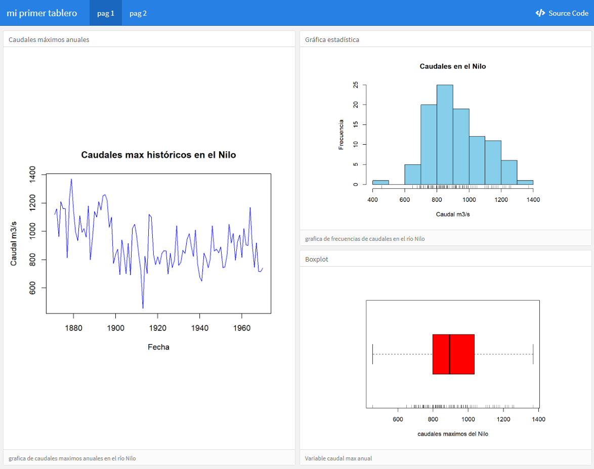
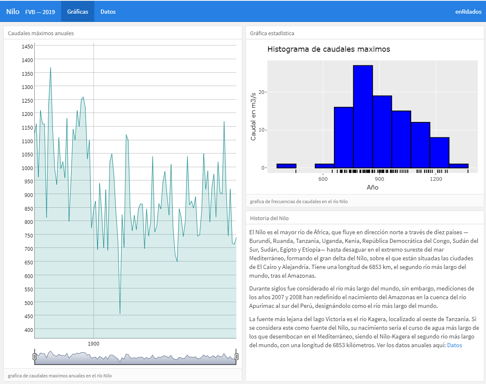
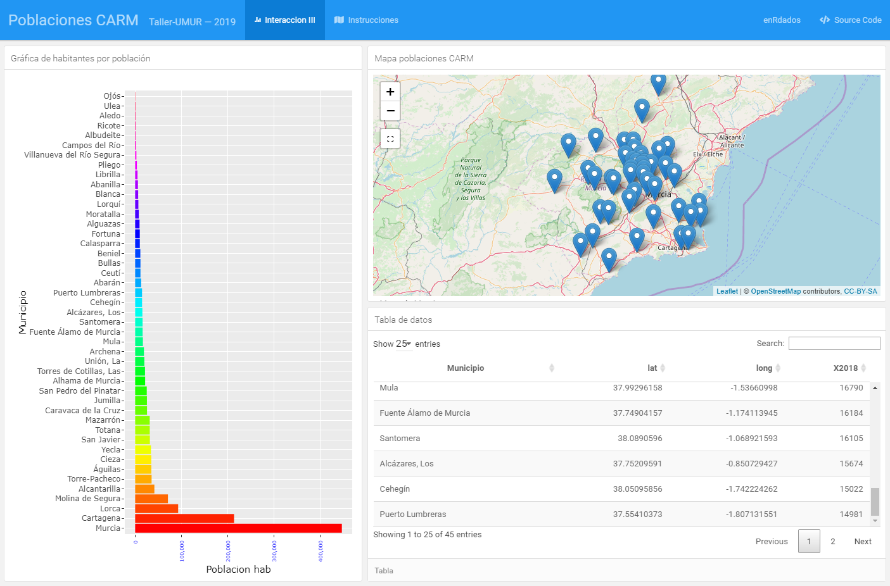
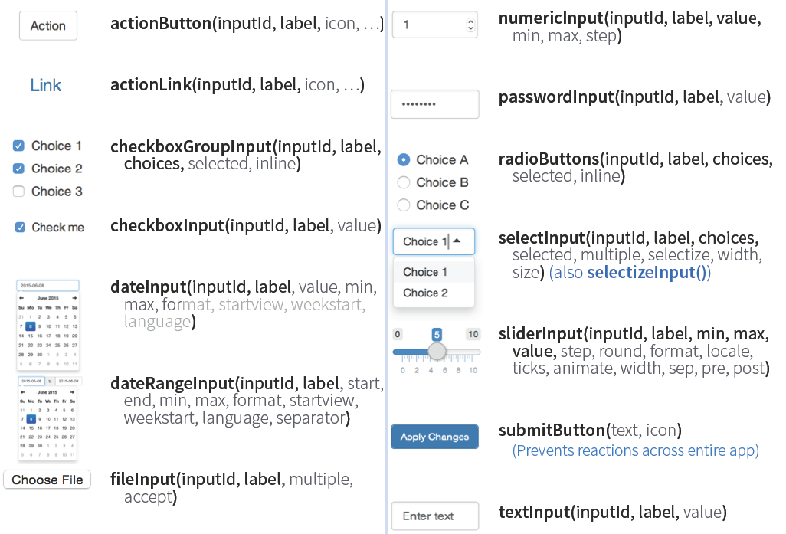
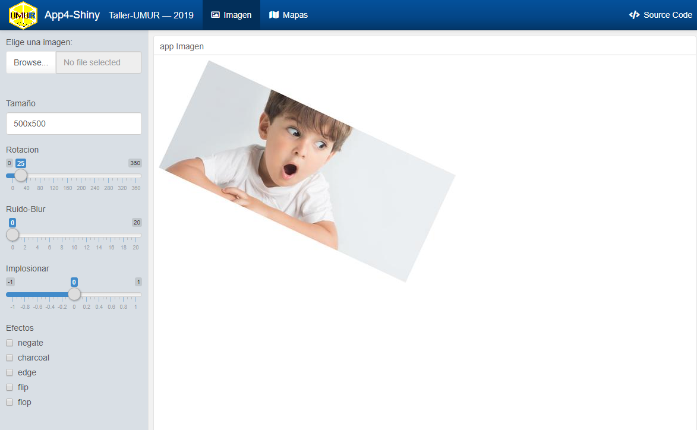
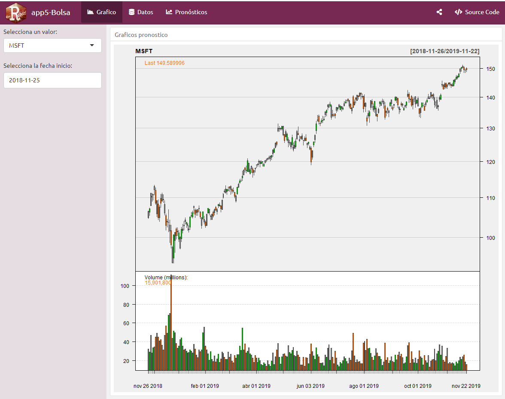

layout: true
background-image: url(imag/Logo_enrdados_blanco.png)
background-position: 98% 1% 
background-size: 6%

```{r setup, include=FALSE}
#<div class="my-footer"><span>www.enRdados.net</span></div> 
options(htmltools.dir.version = FALSE)
library("xaringan")
# https://yihui.name/en/2017/08/why-xaringan-remark-js/
# para verolo en directo
#  xaringan::inf_mr()
#https://yihui.name/en/2019/02/ultimate-inf-mr/
# https://slides.yihui.name/xaringan/#8
# https://yihui.name/en/2017/08/why-xaringan-remark-js/
# para guardar la presentacion como pdf
# necesito el paquete pagedown y chrome instalado en el PC
# pagedown::chrome_print("C:/R/proyectos/mentoring/pMentoring3.html")
#
#     css:
#      - default
#      - default-fonts 
#      - "animate.min.css"  
```

---

class: inverse

# Hola

.pull-left[


]

.pull-right[


- https://enrdados.netlify.com/
- http://www.enRdados.net

]

---

class: animated, fadeInRight

# Índice del taller

- ¿Qué es *flexdashboard*?

- Diseño de paneles `r icon::fa('arrow-alt-circle-right')` **Práctica 1**
 
- Iteractividad I  (*htmlWidgets*) `r icon::fa('arrow-alt-circle-right')` **Práctica 2**

- Iteractividad II (*crosstalk*) `r icon::fa('arrow-alt-circle-right')` **Práctica 3** 

- Iteractividad III (*Shiny* ) `r icon::fa('arrow-alt-circle-right')` **Práctica 4**

- Diseño avanzado y publicación `r icon::fa('arrow-alt-circle-right')` **Práctica 5**


---

background-image: url(imag/fondo5.jpg)
background-size: cover

#¿qué es *flexdashboard*?

[flexdashboard](https://rmarkdown.rstudio.com/flexdashboard/) es una extensión de *Rmarkdown* desarrollada por RSTUDIO para facilitar la creación de paneles (*applicaciones web*).


- <https://rmarkdown.rstudio.com/flexdashboard/>


Los paneles permiten comunicar grandes cantidaes de informacion visual rápidamente. Son herramientas esenciales en la toma de decisiones empresariales

existen otras librerías para hacer tableros con shiny mas completas como shinydashboard
https://rstudio.github.io/shinydashboard/structure.html

---

# Ejemplos


---
# Panel bolsa


---

# Ejemplos de tableros


---

# Ejemplo reales de flexdashboard

## Estáticos (lado cliente)

- [informe de ventas](ejemplos/salesreport.html)
- [cementerios nucleares USA](ejemplos/wastelands.html)

## Dinámicos (lado servidor)

- [Informe de diversidad de razas en USA](https://walkerke.shinyapps.io/neighborhood_diversity/)

- [contaminacion en el mundo PM2.5](https://paula-moraga.github.io/book-geospatial/sec-dashboardswithshiny.html)

---

# Por cierto... ¿qué es shiny?

*Shiny* es un complemento para R que permite crear aplicaciones web interactivas. Una aplicación Shiny se compone de:

- *ui* --> una interfaz de usuario  que controla el diseño y la apariencia de la aplicación
- *server* --> una función que contiene las instrucciones para construir los objetos que se muestran en la interfaz de usuario.

Las aplicaciones *Shiny* permiten la **interacción** del usuario mediante una funcionalidad llamada *reactividad*.


```{r echo=FALSE, out.width = "600px", out.height="150px",fig.align='center'}
knitr::include_graphics("imag/shiny.png")
# https://paula-moraga.github.io/book-geospatial/sec-shiny.html
```


---
# Ejemplo Shiny 

<iframe src="https://inwtlab.shinyapps.io/ecomAnalytics/" width="800" height="600">
</iframe>

---

<iframe src="https://walkerke.shinyapps.io/neighborhood_diversity/" width="800" height="600">
</iframe>

---


# Crear una app fácil con flex 

 1. Diseño de la plantilla 
 2. Programación y relleno de cajas
 3. Reactividad
 3. Publicar


---

# Fichero de partida Rmarkdown

.pull-left[ app.Rmd

```YAML
---
title: "Memoria Anual" 
author: "pepito"
date: "2019"
output: 
    flexdashboard::flex_dashboard: 
      orientation: rows
---
    
## Row

### Chart 1
   
## Row

### Chart 2
    
### Chart 3
```
]

.pull-right[


]

---

# Encabezado YAML de flexdashboard


```YAML
---
title: "Mi primer tablero"
output:
  flexdashboard::flex_dashboard:
    orientation: columns
    vertical_layout: fill
    logo: "imag/logoR.png"
    social: menu
    source_code: embed
    theme: united
runtime: shiny
---

```

---
class: animated, fadeInLeft

# Formato 

Cualquier tablero lo crearemos a partir de 3 niveles básicos:

.pull-left[

1. **Páginas** 
```
#        `===`
```
2. **Columnas - filas**
```
##       `---` 
```
3. **Cajas** 
```
### 
```
4. Extras:
   + {.sidebar} 
   + {.tabset} 
   + {data-width=350} 
   + {data-height=600}
]

.pull-right[


]

---

class: inverse, center, middle

# PRÁCTICA I

Nuestro primer tablero

1. abrir RSTUDIO ->RMarkdown -> from template -> flexdashboard
2. crear un diseño de dos paginas, 1 pag: graficos, 2 pag tabla datos
3. insertar código de graficos en cada caja 

```{r echo=FALSE, out.width = "300px", out.height="150px",fig.align='center'}
knitr::include_graphics("imag/aempezar.gif")
# https://paula-moraga.github.io/book-geospatial/sec-shiny.html
```

---

# Práctica 1 resultado 




---

# Complementos

## Value boxes

```{r, eval=FALSE}
library(flexdashboard)
articles <- 204
valueBox(articles, 
         icon = "fa-pencil", 
         caption = "Articles per Day")
```


Los iconos los puedes buscar aqui:

 - [Font Awesome](https://fortawesome.github.io/Font-Awesome/icons/)
 - [Ionicons](http://ionicons.com/)
 - [Bootstrap Glyphicons](https://getbootstrap.com/components/#glyphicons)


---

# Complementos

## Gauge

```{r, eval=FALSE}

satisfaction <- 86
gauge(satisfaction, min = 0, max = 100, symbol = '%', 
  label = "Satisfaction", gaugeSectors(
  success = c(80, 100), warning = c(40, 79), danger = c(0, 39)
))
```


---

class: inverse

# Interactividad con  htmlwidgets

- [https://www.htmlwidgets.org/](https://www.htmlwidgets.org/)
- <http://gallery.htmlwidgets.org/>
- [un ejemplo muy completo aquí](https://matt-dray.github.io/earl18-crosstalk/04_leaflet-flexdash-dt-crosstalk.html#interactives)

.pull-left[
```{r eval=TRUE,echo=FALSE, out.height="400px"}
library(ggplot2)
ggplot(data = diamonds, aes(x = cut, fill = clarity)) +
            geom_bar(position = "dodge")

```
]

.pull-right[
```{r eval=TRUE, echo=FALSE, out.height="400px",warning=FALSE,message=FALSE}
library(ggplot2)
library(plotly)
p <- ggplot(data = diamonds, aes(x = cut, fill = clarity)) +
            geom_bar(position = "dodge")
ggplotly(p)
```
]

---

class: inverse, center, middle

# PRÁCTICA 2

Sustituimos los gráficos anteriores *htmlwidgets* y añadimos complementos.



---
# Interacción III- crosstalk

Hay una forma intermedia entre el html de cliente y el que trabaja en servidor, se trata de usar datos comunes entre htmlwidget con [crosstalk](https://rstudio.github.io/crosstalk/):

Es una librería javascript que permite compartir datos entre widget en el lado cliente.

Se usa de manera muy simple compartiendo unos datos con la función: *highlight_key* o *SharedData$new*.

---

# Interacción III - Práctica 3



---
# Empezamos con Shiny

## Input
Shiny se ejecuta en el servidor no en el cliente. Para indicar qué variables cambian se han programado una serie de objetos que permiten dar las entradas que admite el servidor estos objetos son los inputs de Shiny.

## Output
Es el objeto de se calcula en el servidor


---
# Reactividad


---
class: animated, jackInTheBox

# Objetos Shiny  **input**


---

# Inputs



---

# Outputs

Para que la variable reaccione en la app, hay que insertarla dentro de un objeto *output*, que indica objetos que dibuja el servidor y que están relacionados intimamente con tipos de salida de R.


---

# PRÁCTICA 4. App shiny 

- [creamos una aplicación de tratamiento de imágenes](http://35.180.138.205/shiny/rstudio/taller_flex/app4.Rmd)
- creamos una aplicación sobre un mapa leaflet 



---
# PRÁCTICA 5. 
# Hacerse rico ¿con R?

- [App de Bolsa con R](http://35.180.138.205/shiny/rstudio/taller_flex/app5.Rmd)




---
# Diseño

## Temas predefinidos 

- <http://www.sangerw.com/blog/flexdashboardthemes/>

## iconos

Los iconos los puedes buscar aqui:

 - [Font Awesome](https://fortawesome.github.io/Font-Awesome/icons/)
 - [Ionicons](http://ionicons.com/)
 - [Bootstrap Glyphicons](https://getbootstrap.com/components/#glyphicons)


---
class: animated, jackInTheBox

# Publicar la app

Opciones:
- **NO Shiny:**
 - html
 - RPubs
- **SI Shiny:** 
 - [https://www.shinyapps.io/](shinyapps.io) es la opción más sencilla. 5 app gratis!!!
 - [AWS](https://aws.amazon.com/es/) Instalar y [crear tu propio servidor Gratis en AWS](https://enrdados.netlify.com/post/instalar-r-shiny-en-aws/)   
 - crear tu servidor en casa
 - otras muchas opciones de pago en [RSTUDIOcloud](https://rstudio.cloud/) etc..

---
class: inverse, center, middle,animated, jackInTheBox

# Esto es todo amigos


Muchas Gracias!!


