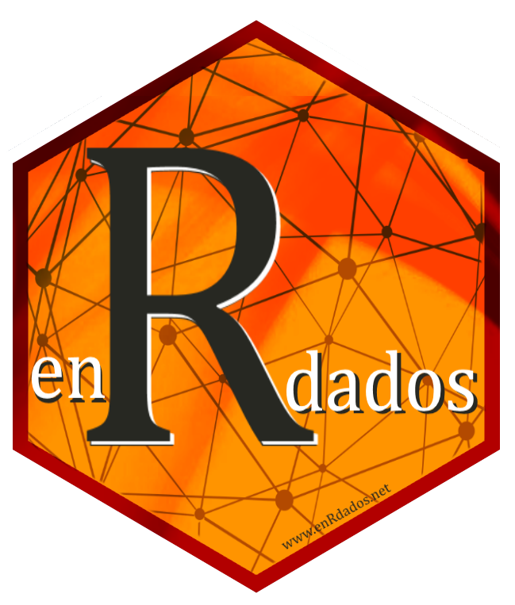

layout: true
background-image: url(imag/Logo_enrdados_blanco.png)
background-position: 98% 1% 
background-size: 5%

```{r setup, include=FALSE}
#<div class="my-footer"><span>www.enRdados.net</span></div> 
options(htmltools.dir.version = FALSE)
library("xaringan")
# https://yihui.name/en/2017/08/why-xaringan-remark-js/
# para verolo en directo
#  xaringan::inf_mr()
#https://yihui.name/en/2019/02/ultimate-inf-mr/
# https://slides.yihui.name/xaringan/#8
# https://yihui.name/en/2017/08/why-xaringan-remark-js/
# para guardar la presentacion como pdf
# necesito el paquete pagedown y chrome instalado en el PC
# pagedown::chrome_print("C:/R/proyectos/mentoring/pMentoring3.html")
```


---
class: animated, fadeInRight

# ¿que vamos a ver?

- `r icon::fa('arrow-alt-circle-right')` ¿qué es `flexdashboard`?

- `r icon::fa('arrow-alt-circle-right')` Diseño de paneles (tableros)
 
- **Práctica 1**: Crear tablero estático
 
- Iteractividad I 

- Iteractividad II (htmlWidgets)

- **Práctica 2**: Crear tablero dinámico 

- Iteractividad III (*Shiny* - servidores)

- **Práctica 3**: Crear app dinámica 

- Diseño avanzado y publicación

- **Práctica 4**: Crear app completa y publicarla en Internet 


```{r echo=FALSE, out.width = "600px", out.height="200px",fig.align='center'}

```

---

#¿qué es `flexdashboard`?

*flexdashboard* es una extensión de *RMarkdown* que ha desarrollado RSTUDIO para facilitar la generación de aplicaciones o informes web, denominados genéricamente tableros.
El manual básico está en <https://rmarkdown.rstudio.com/flexdashboard/>

Estos tableros pueden ser estáticos o dinámicos según la forma de interacción con el cliente -servidor de datos.

---

# ¿qué es un tablero?

Estos son algunos ejemplos de tableros


---

# Ejemplos de tableros


<iframe src="wastelands.html" width="800" height="600">
</iframe>

---
# ¿por qué usar R para esto?

- Elimina pasos en la informacion, ya que el analista puede crear directamente y presentar los resultados como si fuese 
- Facilita análisis presentación y comunicación
- Eliminar al intermediario; capacitar a los analistas para producir paneles de nivel ejecutivo
- Personalización prácticamente infinita


---

# Creacción de tableros 

Se crean como un fichero rmarkdown *.Rmd. Una vez cargada la librería puede obtenerse desde la plantilla de RSTUDIO.

Como  todos los ficheros Rmd, cuentan con un encabezado YAML en el que se definen los parámetros generales de salida, y el resto es código rmarkdown.


---

# Encabezado YAML de flexdashboard

```YAML
---
title: "Mi primer tablero"
output:
  flexdashboard::flex_dashboard:
    orientation: columns
    vertical_layout: fill
    logo: "imag/logoR.png"
    social: menu
    source_code: embed
    theme: united
   # css: bootswatch-3.3.5-4/flatly/bootstrap.css
runtime: shiny
---

```

---
class: animated, fadeInLeft

# Formato 

Cualquier aplicación la crearemos a partir de 3 niveles o formatos específicos 

* Niveles: 

  1. Pestañas #  o  `===`
 
  2. Columnas o filas ##  o `---`  {.sidebar} {.tabset}

  3. Cajas ###  (pueden ser filas columnas o pestañas)

Dentro de una caja de nivel 3 podremos usar código rmarkdown normal y corriente o trozos de código R en formato habitual en Rmarkdown es decir entrecomillado  $```{r}$ y $```$.

---

# Ejemplos de diseños de app

Inserter ejemplos de diferentes diseños de aplicaciones

```yaml
---
title: "Row Orientation"
output: 
  flexdashboard::flex_dashboard:
    orientation: rows
---
    
## Row

### Chart 1
    

   
## Row

### Chart 2

    
### Chart 3

```


---

class: inverse, center, middle

# Interactividad simple

```{r echo=FALSE, fig.align='center', out.width = "600px", out.height="400px"}
knitr::include_graphics("imag/puertas.jpg")
```

--

El mentoring es la `r icon::fa('key')` para abrir muchas `r icon::fa('door-open')`

---
class: animated, jackInTheBox

# Objetivos del programa

- Acelerar el proceso de desarrollo personal `r icon::fa('rocket')`
- Favorece la transmisión de valores y conocimiento `r icon::fa('people-carry')`
- Transmitir experiencia `r icon::fa('user-graduate')`
- Crea vínculos personales, profesionales y de colectivo.`r icon::fa('handshake')`
- Motiva, mejora la confianza y refuerza la iniciativa personal. `r icon::fa('award')`

```{r echo=FALSE, out.width = "500px", out.height="250px",fig.align='center'}
knitr::include_graphics("imag/civileng.jpg")
```
---
class: inverse, animated, fadeInLeft

# Objetivos del programa II

* `r icon::fa('user-friends')` Actuar sobre vuestras habilidades blandas  

* `r icon::fa('hand-holding-usd')` La carrera te aporta conocimientos técnicos, el mentoring otras habilidades complementarias

```{r echo=FALSE, fig.align='center', out.width = "600px", out.height="400px"}
knitr::include_graphics("imag/competencias_soft_competencias_hard_infografia.png")
```


---
class: inverse,animated, fadeInLeft

# ¿Quíenes intervienen?

.pull-left[

# Mentor

- Facilita el desarrollo del **pupilo**, a través del intercambio de sus propios recursos, conocimientos, valores, habilidades, perspectivas, actitudes y competencias.

- Le ofrece la oportunidad de desarrollar nuevas perspectivas, *hacerse preguntas*, conocer otras inquietudes y ampliar su visión  personal y profesional.


]

.pull-right[
# Pupilo

- El **pupilo** desarrollará habilidades y conocimientos que le ayudarán a alcanzar las metas que *él mismo defina*.

```{r echo=FALSE, out.width = "500px", out.height="200px"}
knitr::include_graphics("imag/jodaLuke.jpg")
```
]

---

# Habilidades requeridas
.pull-left[
# Mentor
- Escucha activa
- Construcción gradual de confianza
- Definición de objetivos y desarrollo de capacidades
- Dar soporte e inspiración
- Ser ejemplo

```{r echo=FALSE, out.width = "500px", out.height="200px"}
knitr::include_graphics("imag/Karate-Kid.jpg")
```

]
.pull-right[
# Pupilo
- Escucha activa
- Voluntad de aprendizaje
- Construcción gradual de confianza
- Definir objetivos
- **Proactividad**


```{r echo=FALSE, fig.align='center', out.width = "200px", out.height="200px"}
knitr::include_graphics("imag/leongato.jpg")
```

]
---
class: animated, jackInTheBox

# Recursos

* https://github.com/rstudio-education/shiny-wsds18/blob/master/04-dashboards/04-dashboards.pdf
* http://arm.rbind.io/slides/flexdashboard.html#1

* https://jenthompson.me/resources/
* https://rstudio-education.github.io/shiny-wsds18/
* https://github.com/jmcphers/flexdashboard-talk/blob/master/flexdashboards.Rmd
* https://github.com/rstudio-education/shiny-wsds18/blob/master/02-reactivity/02-reactivity.pdf

* https://github.com/rstudio-education/arm-workshop-rsc2019
* iconos en :https://fontawesome.com/icons?d=gallery&q=gra&m=free
* https://ionicons.com/
* http://www.htmlwidgets.org/

---

background-image: url(imag/fondo6.jpg)
background-size: cover

# diferencias entre Shiny vs Flexdashboard

.pull-left[

## shiny
 
- Codigo especifico UI
- no muy fácil
- dinámico
- Bootstrap

]

.pull-right[

##Flexdashboard

- Rmarkdown
-super facil
- dinámico o estático
- CSS
]

---

# Publicar la app

Después de crear la app con shiny se puede alojar en <ShinyApps.io> es la opción más sencilla. La cuenta gratuita da derecho a 5 app en el servidor.

Otras opciones son RSTUDIO connect, o crearse un servidor Shiny propio en el que publicar, pr ejemplo en mi blog teneis cómo hacerlo en AWS

### webs estáticas o con crosstalk

- mandar html
- RPubs
- Servidor propio

### webs Shiny
- shinyapp.io
- AWS
- RSTUDIOcloud
- Serividor propio


---
class: inverse, center, middle,animated, jackInTheBox

# Si tienes talento, no lo uses para llegar más lejos, úsalo para llegar más acompañado

Muchas Gracias!!

`r icon::fa('paper-plane')`

