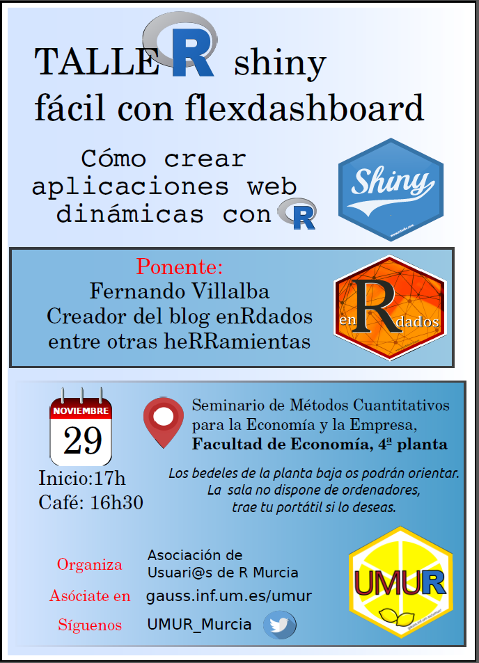
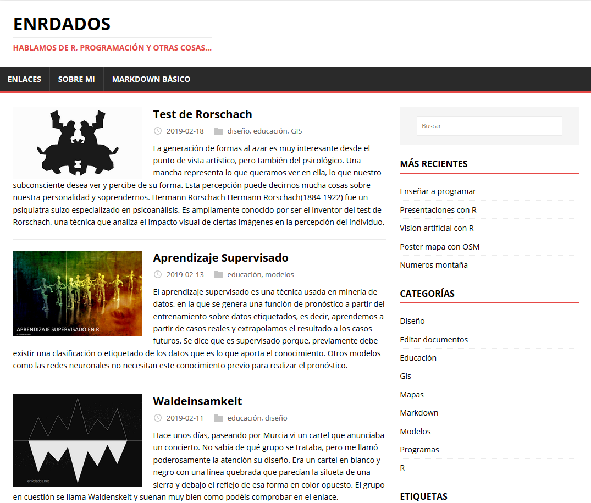
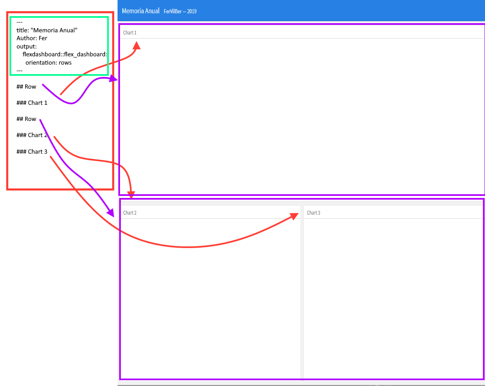
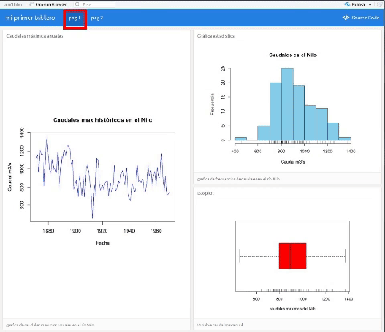
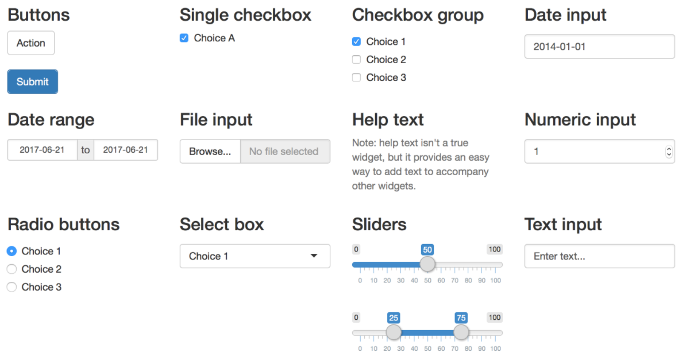

layout: true
background-image: url(imag/Logo_enrdados_blanco.png)
background-position: 98% 1% 
background-size: 6%

```{r setup, include=FALSE}
#<div class="my-footer"><span>www.enRdados.net</span></div> 
options(htmltools.dir.version = FALSE)
library("xaringan")
# https://yihui.name/en/2017/08/why-xaringan-remark-js/
# para verolo en directo
#  xaringan::inf_mr()
#https://yihui.name/en/2019/02/ultimate-inf-mr/
# https://slides.yihui.name/xaringan/#8
# https://yihui.name/en/2017/08/why-xaringan-remark-js/
# para guardar la presentacion como pdf
# necesito el paquete pagedown y chrome instalado en el PC
# pagedown::chrome_print("C:/R/proyectos/mentoring/pMentoring3.html")
#
#     css:
#      - default
#      - default-fonts 
#      - "animate.min.css"  
```

---

class: inverse

# Hola

.pull-left[



]

.pull-right[



- https://enrdados.netlify.com/
- http://www.enRdados.net

]

---

class: animated, fadeInRight

# Índice del taller

- ¿Qué es *flexdashboard*?

- Diseño de paneles `r icon::fa('arrow-alt-circle-right')` **Práctica**
 
- Iteractividad I  (*htmlWidgets*) `r icon::fa('arrow-alt-circle-right')` **Práctica**

- Iteractividad II (*htmlWidgets*) `r icon::fa('arrow-alt-circle-right')` **Práctica** 

- Iteractividad III (*Shiny* ) `r icon::fa('arrow-alt-circle-right')` **Práctica **

- Diseño avanzado y publicación `r icon::fa('arrow-alt-circle-right')` **Práctica**


---

background-image: url(imag/fondo5.jpg)
background-size: cover

#¿qué es *flexdashboard*?

[flexdashboard](https://rmarkdown.rstudio.com/flexdashboard/) es una extensión de *Rmarkdown* desarrollada por RSTUDIO para facilitar la creación de paneles (*applicaciones web*).


- <https://rmarkdown.rstudio.com/flexdashboard/>


Los paneles permiten comunicar grandes cantidaes de informacion visual rápidamente. Son herramientas esenciales en la toma de decisiones empresariales

existen otras librerías para hacer tableros con shiny mas completas como shinydashboard
https://rstudio.github.io/shinydashboard/structure.html

---

# Ejemplos


---
# Panel bolsa


---

# Ejemplos de tableros


---

# Ejemplo reales de flexdashboard

## Estáticos (lado cliente)

- [informe de ventas](salesreport.html)
- [informe de cementerios nucleares](wastelands.html)

## Dinámicos (lado servidor)

- [Informe de diversidad de razas en USA](https://walkerke.shinyapps.io/neighborhood_diversity/)

- [contaminacion en el mundo PM2.5](air_polution.html)

---

# Por cierto... ¿qué es shiny?

*Shiny* es un complemento para R que permite crear aplicaciones web interactivas. Una aplicación Shiny se compone de:

- *ui* --> una interfaz de usuario  que controla el diseño y la apariencia de la aplicación
- *server* --> una función que contiene las instrucciones para construir los objetos que se muestran en la interfaz de usuario.

Las aplicaciones *Shiny* permiten la **interacción** del usuario mediante una funcionalidad llamada *reactividad*.


```{r echo=FALSE, out.width = "600px", out.height="150px",fig.align='center'}
knitr::include_graphics("imag/shiny.png")
# https://paula-moraga.github.io/book-geospatial/sec-shiny.html
```


---

<iframe src="flexdashboard-talk-master/wastelands.html" width="800" height="600">
</iframe>

---

<iframe src="https://walkerke.shinyapps.io/neighborhood_diversity/" width="800" height="600">
</iframe>

---


# Crear una app 

 1. Diseño de la plantilla 
 2. Programación y relleno de cajas
 3. Reactividad
 3. Publicar


---

# Fichero de partida rmarkdown

.pull-left[ app.Rmd

```YAML
---
title: "Memoria Anual" 
author: "pepito"
date: "2019"
output: 
    flexdashboard::flex_dashboard: 
      orientation: rows
---
    
## Row

### Chart 1
   
## Row

### Chart 2
    
### Chart 3
```
]

.pull-right[


]

---

# Encabezado YAML de flexdashboard


```YAML
---
title: "Mi primer tablero"
output:
  flexdashboard::flex_dashboard:
    orientation: columns
    vertical_layout: fill
    logo: "imag/logoR.png"
    social: menu
    source_code: embed
    theme: united
runtime: shiny
---

```

---
class: animated, fadeInLeft

# Formato 

Cualquier tablero lo crearemos a partir de 3 niveles básicos:

.pull-left[

1. **Páginas** 
```
#        `===`
```
2. **Columnas - filas**
```
##       `---` 
```
3. **Cajas** 
```
### 
```
4. Extras:
   + {.sidebar} 
   + {.tabset} 
   + {data-width=350} 
   + {data-height=}
]

.pull-right[



]

---

class: inverse, center, middle

# PRÁCTICA I

Nuestro primer tablero

1. abrir RSTUDIO ->RMarkdown -> from template -> flexdashboard
2. crear un diseño de dos paginas, 1 pag: graficos, 2 pag tabla datos
3. insertar código en cada caja

```{r echo=FALSE, out.width = "300px", out.height="150px",fig.align='center'}

# https://paula-moraga.github.io/book-geospatial/sec-shiny.html
```

---

# Complementos

## Value boxes

```{r, eval=FALSE}
library(flexdashboard)
articles <- 204
valueBox(articles, 
         icon = "fa-pencil", 
         caption = "Articles per Day")
```


Los iconos los puedes buscar aqui:

 - [Font Awesome](https://fortawesome.github.io/Font-Awesome/icons/)
 - [Ionicons](http://ionicons.com/)
 - [Bootstrap Glyphicons](https://getbootstrap.com/components/#glyphicons)


---

# Gauge

```{r, eval=FALSE}

satisfaction <- 86
gauge(satisfaction, min = 0, max = 100, symbol = '%', 
  label = "Satisfaction", gaugeSectors(
  success = c(80, 100), warning = c(40, 79), danger = c(0, 39)
))
```


---

class: inverse

# Interactividad con  htmlwidgets

- [https://www.htmlwidgets.org/](https://www.htmlwidgets.org/)
- <http://gallery.htmlwidgets.org/>

.pull-left[
```{r eval=TRUE,echo=FALSE, out.height="400px"}
library(ggplot2)
ggplot(data = diamonds, aes(x = cut, fill = clarity)) +
            geom_bar(position = "dodge")

```
]

.pull-right[
```{r eval=TRUE, echo=FALSE, out.height="400px"}
library(ggplot2)
library(plotly)
p <- ggplot(data = diamonds, aes(x = cut, fill = clarity)) +
            geom_bar(position = "dodge")
ggplotly(p)
```
]

---
class: animated, jackInTheBox

# Objetos Shiny



---
class: inverse,animated, fadeInLeft

# ¿Quíenes intervienen?

.pull-left[

# Mentor

- Facilita el desarrollo del **pupilo**, a través del intercambio de sus propios recursos, conocimientos, valores, habilidades, perspectivas, actitudes y competencias.

- Le ofrece la oportunidad de desarrollar nuevas perspectivas, *hacerse preguntas*, conocer otras inquietudes y ampliar su visión  personal y profesional.


]

.pull-right[
# Pupilo

- El **pupilo** desarrollará habilidades y conocimientos que le ayudarán a alcanzar las metas que *él mismo defina*.

```{r echo=FALSE, out.width = "500px", out.height="200px"}
knitr::include_graphics("imag/jodaLuke.jpg")
```
]

---
class: animated, jackInTheBox

# Recursos

* https://github.com/rstudio-education/shiny-wsds18/blob/master/04-dashboards/04-dashboards.pdf
* http://arm.rbind.io/slides/flexdashboard.html#1

* https://jenthompson.me/resources/
* https://rstudio-education.github.io/shiny-wsds18/
* https://github.com/jmcphers/flexdashboard-talk/blob/master/flexdashboards.Rmd
* https://github.com/rstudio-education/shiny-wsds18/blob/master/02-reactivity/02-reactivity.pdf

* https://github.com/rstudio-education/arm-workshop-rsc2019
* iconos en :https://fontawesome.com/icons?d=gallery&q=gra&m=free
* https://ionicons.com/
* http://www.htmlwidgets.org/

---

background-image: url(imag/fondo6.jpg)
background-size: cover

# diferencias entre Shiny vs Flexdashboard

.pull-left[

## shiny
 
- Codigo especifico UI
- no muy fácil
- dinámico
- Bootstrap

]

.pull-right[

##Flexdashboard

- Rmarkdown
-super facil
- dinámico o estático
- CSS
]

---

# Publicar la app

Después de crear la app con shiny se puede alojar en <ShinyApps.io> es la opción más sencilla. La cuenta gratuita da derecho a 5 app en el servidor.

Otras opciones son RSTUDIO connect, o crearse un servidor Shiny propio en el que publicar, pr ejemplo en mi blog teneis cómo hacerlo en AWS

### webs estáticas o con crosstalk

- mandar html
- RPubs
- Servidor propio

### webs Shiny
- shinyapp.io
- AWS
- RSTUDIOcloud
- Serividor propio


```{r echo=FALSE, out.width = "600px", out.height="150px",fig.align='center'}
knitr::include_graphics("imag/firststep.jpg")
```

---
class: inverse, center, middle,animated, jackInTheBox

# Si tienes talento, no lo uses para llegar más lejos, úsalo para llegar más acompañado

Muchas Gracias!!

`r icon::fa('paper-plane')`

